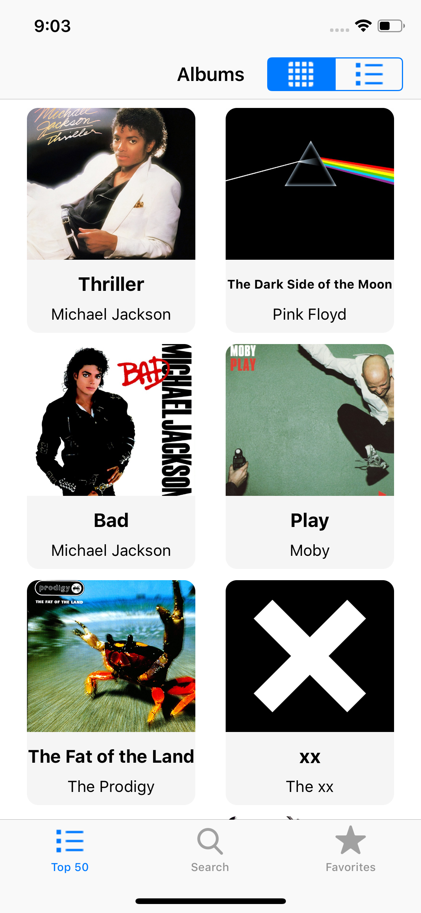
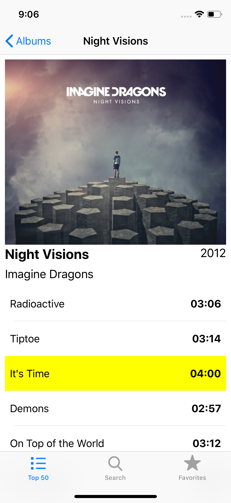
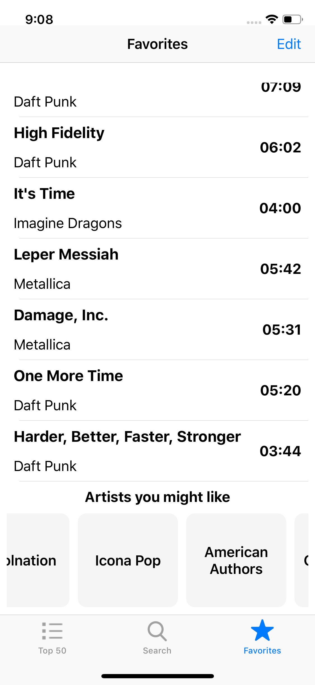

# AlbumBrowser

AlbumBrowser is a native iOS application written in swift where you can browse most loved albums through the years, search for all kinds of other albums and add tracks to your favorites.

Api used: https://theaudiodb.com/

### Home

The home page will display some of the most loved albums based on the api data. Each album has a detail page where you can see the tracks, with an option to add the tracks to your favorites.

  
  

### Search

Uses the api data to search for whichever albums the user likes.

  
  

### Favorites

Here the user can see all their favorite tracks with an option to edit the list. On the bottom of the screen the application will give suggestions to bands and artists based on the favorite tracks that are stored.

  
  

### Cocoapods used
https://cocoapods.org/pods/SVProgressHUD
https://cocoapods.org/pods/SwiftyJSON
https://cocoapods.org/pods/Alamofire
